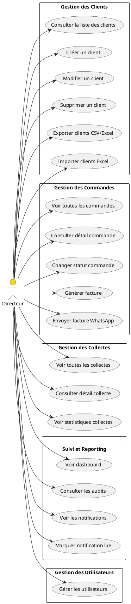
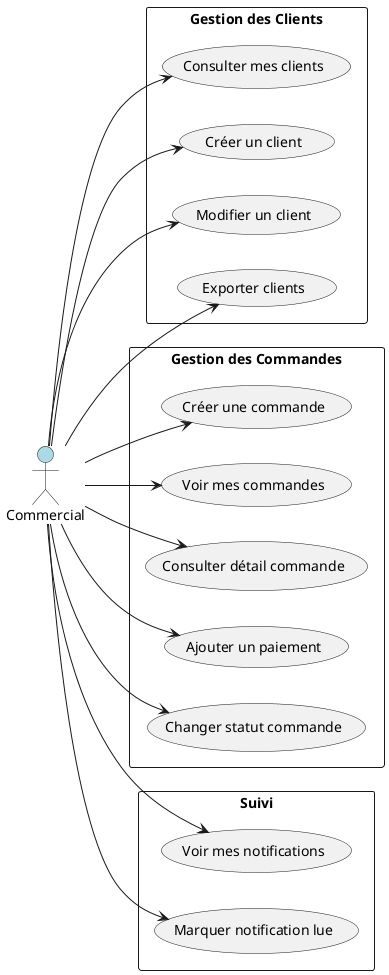
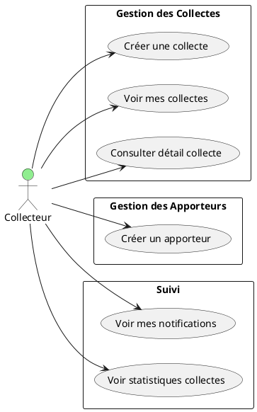
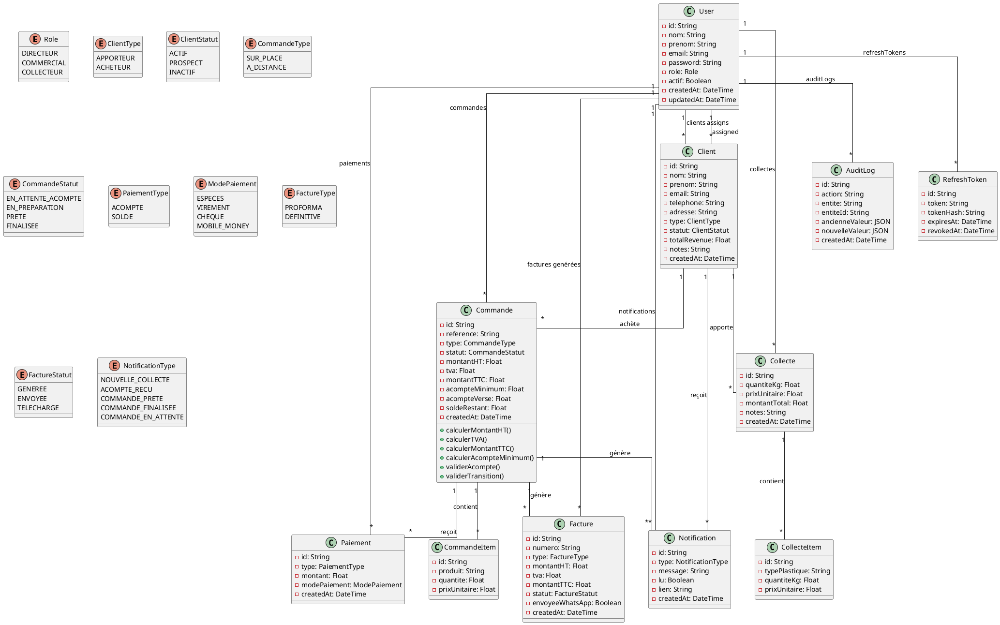
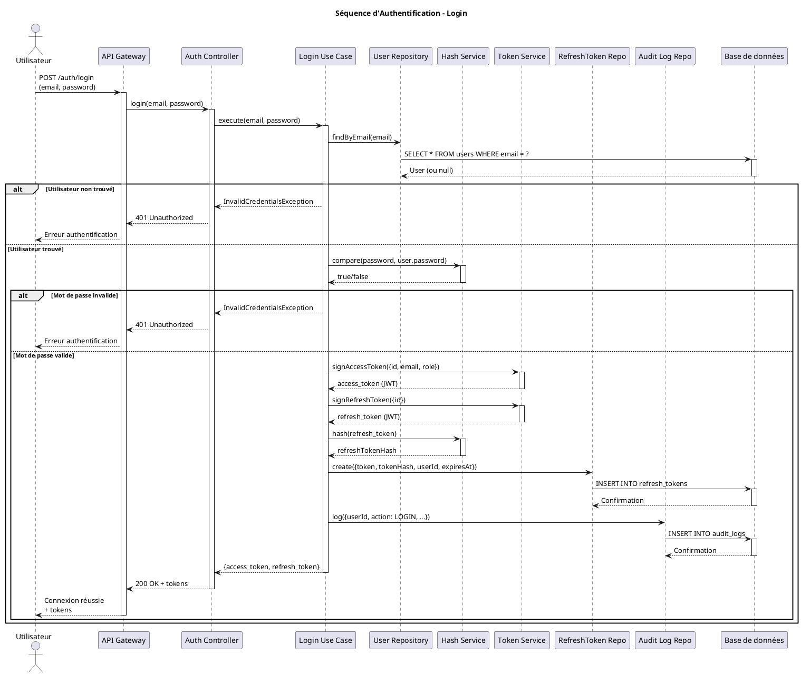
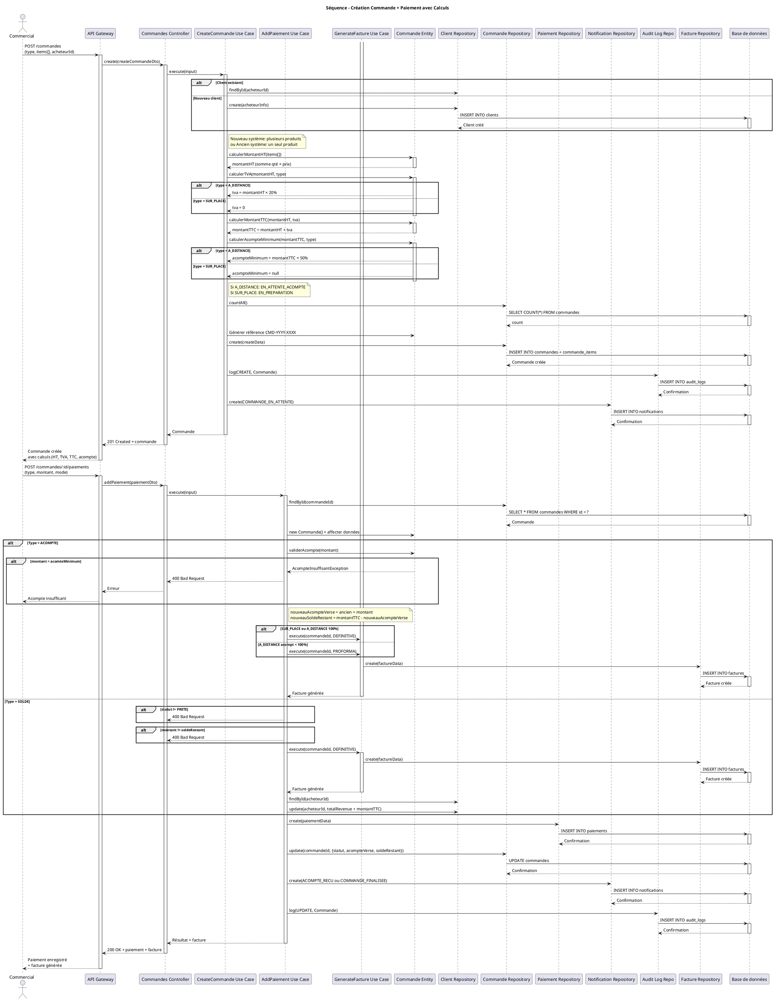
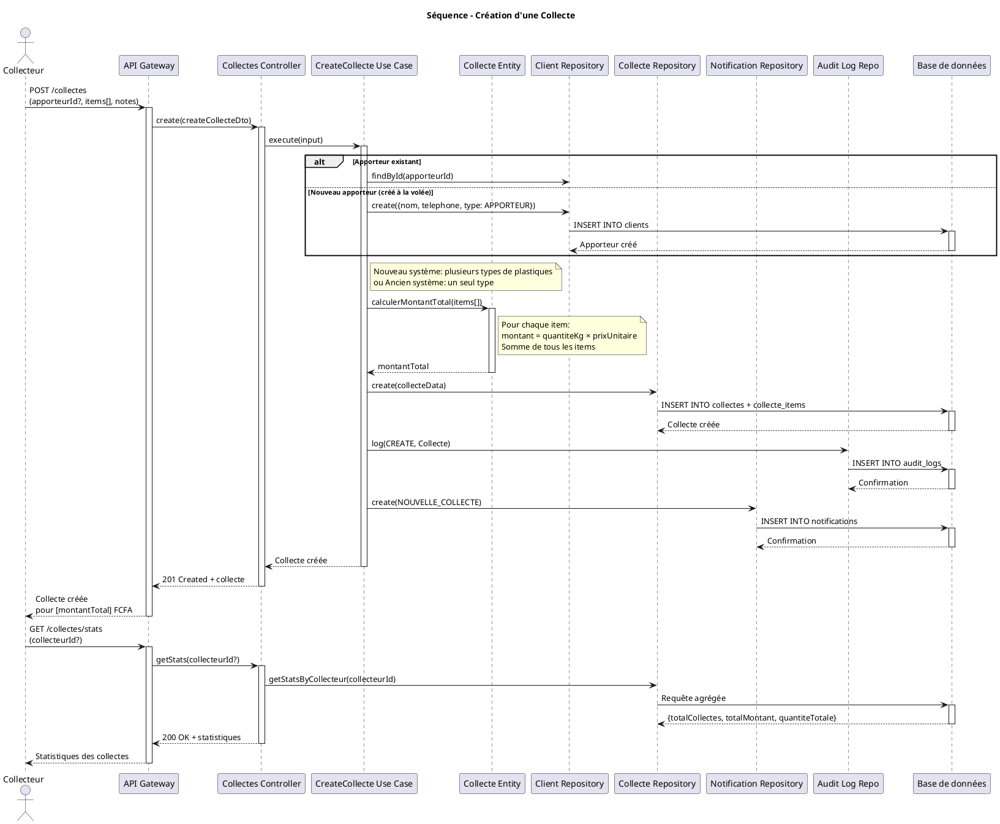

# Diagrammes PlantUML - GesClient Proplast

Ce fichier contient tous les diagrammes UML au format PlantUML pour le projet GesClient.

---

## 1. Diagrammes de Cas d'Utilisation

### 1.1 Cas d'Utilisation - Directeur



### 1.2 Cas d'Utilisation - Commercial



### 1.3 Cas d'Utilisation - Collecteur



---

## 2. Diagramme de Classes



---

## 3. Diagrammes de Séquence

### 3.1 Séquence - Authentification (Complet)



### 3.2 Séquence - Commande avec Calculs (Complet)



### 3.3 Séquence - Collecte (Troisième plus pertinent)



---

## Instructions d'utilisation

### Générer les diagrammes

Vous pouvez utiliser [PlantUML Online Viewer](https://www.plantuml.com/plantuml/) ou installer une extension VS Code comme "PlantUML" pour prévisualiser ces diagrammes.

### Plugins VS Code recommandés
- **PlantUML** par jebbs
- **Markdown Preview Enhanced** pour prévisualiser les fichiers .md

### Commandes pour générer les images

```bash
# Installer PlantUML
npm install -g plantuml

# Générer un diagramme
