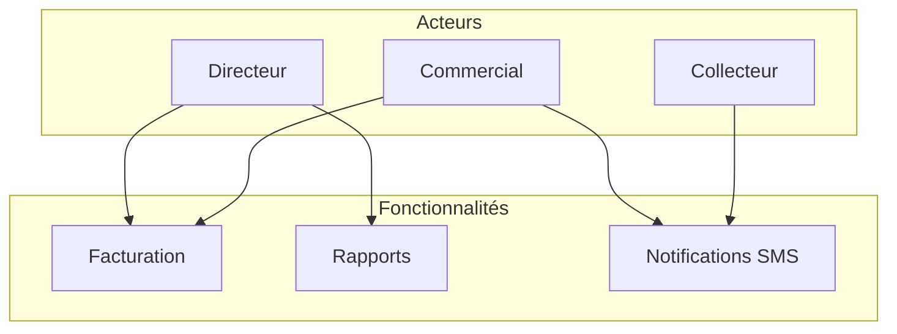
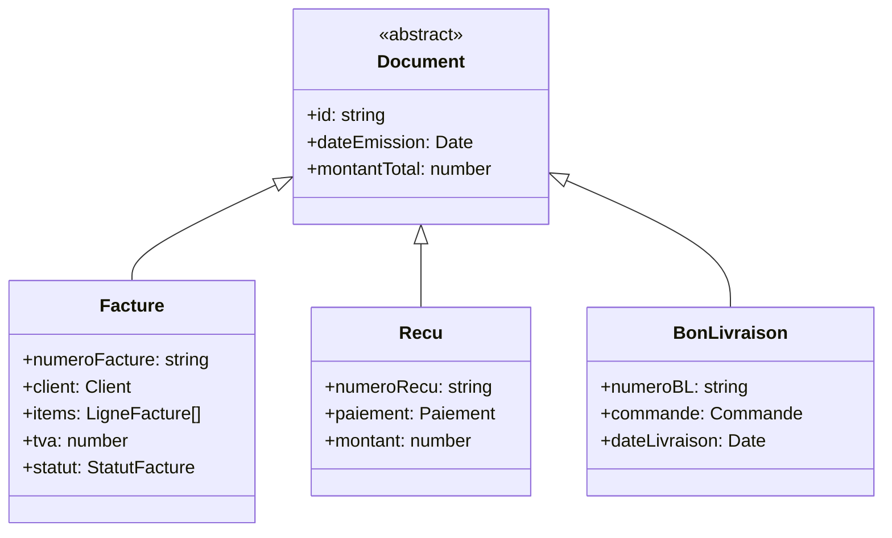
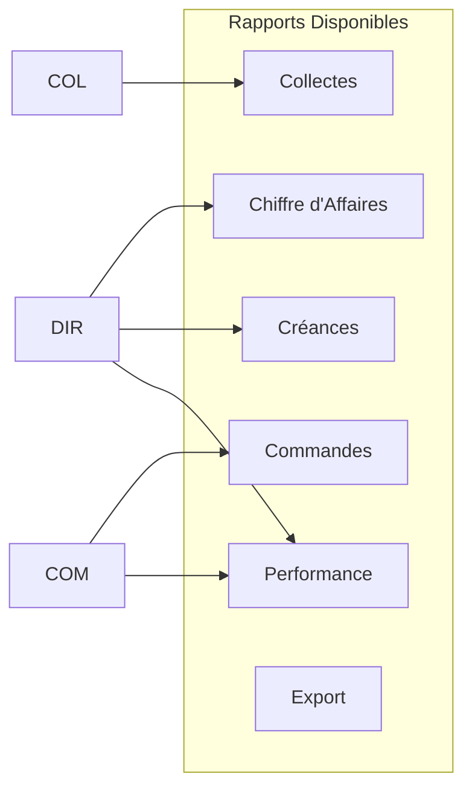
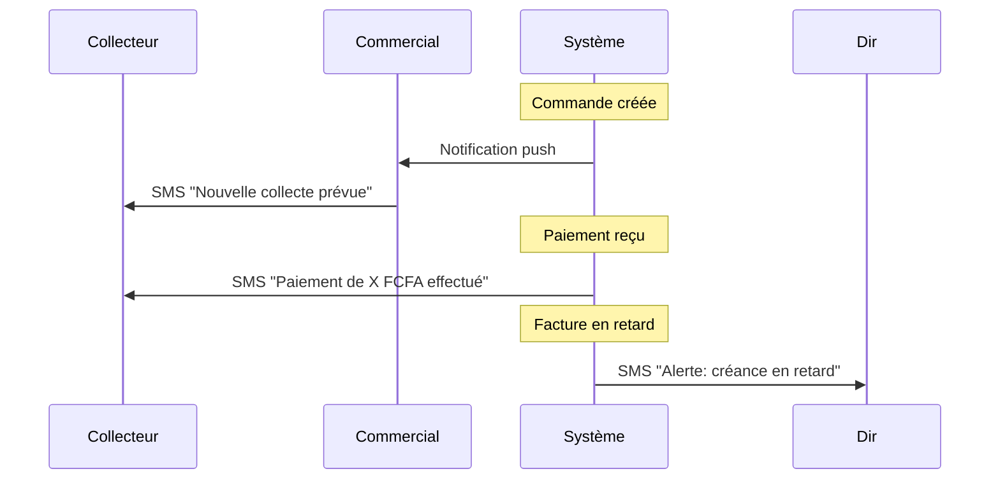
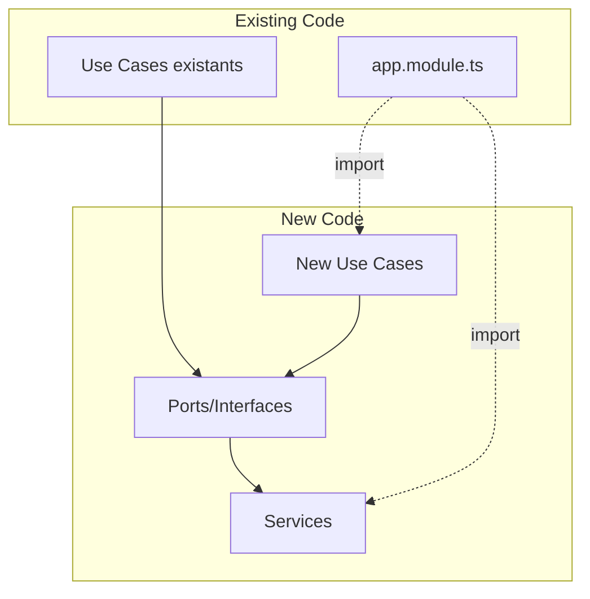

# Proposition d'Implémentation : Facturation, Rapports & SMS

## Vue d'Ensemble des Nouvelles Fonctionnalités



---

## 1. FACTURATION & REÇUS

### 1.1 Importance

| Aspect | Description |
|--------|-------------|
| **Légalité** | Les factures sont obligatoires pour les transactions commerciales |
| **Suivi financier** | Permet de suivre les créances et paiements |
| **Professionnalisme** |文档化的交易增强了客户信任 |
| **Comptabilité** | Nécessaire pour la déclaration fiscale |

### 1.2 Acteurs Ciblés

| Rôle | Utilisation |
|------|-------------|
| **Directeur** | Génère des factures, voit les relevés, gère les impayés |
| **Commercial** | Génère des factures pour les commandes, suit les paiements |

### 1.3 Types de Documents



### 1.4 Architecture d'Implémentation

#### Structure des fichiers à créer

```
src/
├── domain/
│   ├── entities/
│   │   ├── facture.entity.ts        # Entité Facture
│   │   └── ligne-facture.entity.ts  # Lignes de facture
│   ├── enums/
│   │   └── statut-facture.enum.ts  # EMISE, PAYEE, ANNULEE
│   └── ports/
│       └── services/
│           └── pdf.service.ts       # Interface pour génération PDF
│
├── application/
│   └── facturation/
│       ├── generate-facture.use-case.ts
│       ├── generate-recu.use-case.ts
│       ├── generate-bon-livraison.use-case.ts
│       └── get-factures.use-case.ts
│
├── infrastructure/
│   └── services/
│       └── pdf.service.impl.ts      # Implémentation avec PDFKit
│
└── presentation/
    └── facturation/
        ├── facturation.controller.ts
        ├── facturation.module.ts
        └── dto/
```

#### Code à Implémenter

**1. Entité Facture** (`src/domain/entities/facture.entity.ts`)

```typescript
import { Client } from './client.entity';
import { Commande } from './commande.entity';

export enum StatutFacture {
  EMISE = 'EMISE',
  PAYEE = 'PAYEE',
  PARTIELLEMENT_PAYEE = 'PARTIELLEMENT_PAYEE',
  ANNULEE = 'ANNULEE',
}

export class Facture {
  id!: string;
  numeroFacture!: string;
  client!: Client;
  commandes!: Commande[];
  lignes!: LigneFacture[];
  sousTotal!: number;
  tva!: number;
  montantTotal!: number;
  statut!: StatutFacture;
  dateEmission!: Date;
  dateEcheance?: Date;
  createdAt!: Date;
}

export class LigneFacture {
  designation!: string;
  quantite!: number;
  prixUnitaire!: number;
  montant!: number;
}
```

**2. Port PDF** (`src/domain/ports/services/pdf.service.ts`)

```typescript
export interface PdfService {
  generateFacture(facture: any): Promise<Buffer>;
  generateRecu(paiement: any): Promise<Buffer>;
  generateBonLivraison(commande: any): Promise<Buffer>;
}
```

**3. Use Case Facture** (`src/application/facturation/generate-facture.use-case.ts`)

```typescript
import { Injectable, Inject } from '@nestjs/common';
import { ClientRepository } from '../../domain/ports/repositories/client.repository';
import { CommandeRepository } from '../../domain/ports/repositories/commande.repository';
import { PdfService } from '../../domain/ports/services/pdf.service';
import { Facture, StatutFacture } from '../../domain/entities/facture.entity';

@Injectable()
export class GenerateFactureUseCase {
  constructor(
    @Inject('ClientRepository') private clientRepo: ClientRepository,
    @Inject('CommandeRepository') private commandeRepo: CommandeRepository,
    @Inject('PdfService') private pdfService: PdfService,
  ) {}

  async execute(commandeId: string): Promise<{ facture: Facture; pdf: Buffer }> {
    // 1. Récupérer la commande
    const commande = await this.commandeRepo.findById(commandeId);
    if (!commande) throw new CommandeNotFoundException(commandeId);

    // 2. Générer le numéro de facture
    const numeroFacture = await this.generateNumeroFacture();

    // 3. Créer l'entité facture
    const facture = new Facture();
    facture.id = crypto.randomUUID();
    facture.numeroFacture = numeroFacture;
    facture.client = commande.acheteur;
    facture.commandes = [commande];
    // ... calcul des lignes, TVA, etc.

    // 4. Générer le PDF
    const pdf = await this.pdfService.generateFacture(facture);

    return { facture, pdf };
  }

  private async generateNumeroFacture(): Promise<string> {
    const year = new Date().getFullYear();
    const count = await this.getFactureCountThisYear();
    return `FAC-${year}-${String(count + 1).padStart(4, '0')}`;
  }
}
```

---

## 2. RAPPORTS & ANALYTICS

### 2.1 Importance

| Aspect | Description |
|--------|-------------|
| **Décision** | Permet au directeur de prendre des décisions éclairées |
| **Suivi** | Visualisation des performances (ventes, collectes) |
| **Objectifs** | Comparaison par rapport aux objectifs |
| **Transparence** | Reporting pour les parties prenantes |

### 2.2 Acteurs Ciblés

| Rôle | Accès |
|------|-------|
| **Directeur** | Tous les rapports, dashboard complet |
| **Commercial** | Ses propres performances |
| **Collecteur** | Ses propres collectes |

### 2.3 Types de Rapports



### 2.4 Architecture d'Implémentation

```
src/
├── application/
│   └── rapports/
│       ├── get-rapport-ca.use-case.ts
│       ├── get-rapport-collectes.use-case.ts
│       ├── get-rapport-creances.use-case.ts
│       └── export-rapport.use-case.ts
│
├── presentation/
│   └── rapports/
│       ├── rapports.controller.ts
│       ├── rapports.module.ts
│       └── dto/
│           ├── rapport-ca.dto.ts
│           └── rapport-collecte.dto.ts
```

**Use Case Rapport CA** (`src/application/rapports/get-rapport-ca.use-case.ts`)

```typescript
import { Injectable } from '@nestjs/common';
import { StatsRepository } from '../../domain/ports/repositories/stats.repository';

export interface RapportCA {
  periode: { debut: Date; fin: Date };
  totalHT: number;
  totalTVA: number;
  totalTTC: number;
  nombreCommandes: number;
  parMois: { mois: string; montant: number }[];
  parType: { type: string; montant: number }[];
  topClients: { client: string; montant: number }[];
}

@Injectable()
export class GetRapportCAUseCase {
  constructor(private statsRepo: StatsRepository) {}

  async execute(
    dateDebut: Date,
    dateFin: Date,
    type?: 'MENSUEL' | 'TRIMESTRIEL' | 'ANNUEL'
  ): Promise<RapportCA> {
    // Récupérer les données depuis le repository existant
    const commandes = await this.statsRepo.getCommandesBetween(dateDebut, dateFin);
    
    // Calculer les agrégats
    const totalHT = commandes.reduce((sum, c) => sum + c.montantHT, 0);
    const totalTVA = commandes.reduce((sum, c) => sum + c.tva, 0);
    const totalTTC = commandes.reduce((sum, c) => sum + c.montantTTC, 0);

    // Grouper par mois
    const parMois = this.grouperParMois(commandes);

    // Grouper par type de commande
    const parType = this.grouperParType(commandes);

    // Top clients
    const topClients = await this.getTopClients(commandes);

    return {
      periode: { debut: dateDebut, fin: dateFin },
      totalHT,
      totalTVA,
      totalTTC,
      nombreCommandes: commandes.length,
      parMois,
      parType,
      topClients,
    };
  }
}
```

---

## 3. NOTIFICATIONS SMS

### 3.1 Importance

| Aspect | Description |
|--------|-------------|
| **Temps réel** | Alertes immédiates, même sans connexion internet |
| **Accessibilité** | Les collecteurs sur le terrain reçoivent les infos |
| **Fiabilité** | Email peut échouer, SMS plus fiable |
| **Professionnalisme** | Service client amélioré |

### 3.2 Acteurs Ciblés

| Rôle | Notifications reçues |
|------|---------------------|
| **Collecteur** | "Nouvelle collecteassignée", "Prix mis à jour" |
| **Commercial** | "Paiement reçu", "Commande prête" |
| **Directeur** | "Alerte créance", "Rapport quotidien" |
| **Client (Apporteur)** | "Paiement effectué", "Solde actualizado" |

### 3.3 Scénarios d'Envoi



### 3.4 Architecture d'Implémentation

```
src/
├── domain/
│   ├── enums/
│   │   └── sms-type.enum.ts
│   └── ports/
│       └── services/
│           └── sms.service.ts       # Interface abstraite
│
├── application/
│   └── notifications/
│       └── send-sms.use-case.ts
│
├── infrastructure/
│   └── services/
│       ├── sms-ovh.service.ts      # Implémentation OVH
│       ├── sms-orange.service.ts   # Implémentation Orange
│       └── sms-console.service.ts  # Pour développement
│
└── presentation/
    └── notifications/
        └── (étendre le controller existant)
```

**Port SMS** (`src/domain/ports/services/sms.service.ts`)

```typescript
export interface SmsService {
  send(to: string, message: string): Promise<SmsResult>;
  sendBulk(recipients: string[], message: string): Promise<SmsResult[]>;
}

export interface SmsResult {
  success: boolean;
  messageId?: string;
  error?: string;
}
```

**Enum Types SMS** (`src/domain/enums/sms-type.enum.ts`)

```typescript
export enum SmsType {
  COLLECTE_NOUVELLE = 'COLLECTE_NOUVELLE',
  COLLECTE_VALIDEE = 'COLLECTE_VALIDEE',
  PAIEMENT_RECU = 'PAIEMENT_RECU',
  COMMANDE_PRETE = 'COMMANDE_PRETE',
  CREANCE_RETARD = 'CREANCE_RETARD',
  RAPPEL_PAIEMENT = 'RAPPEL_PAIEMENT',
}

export const SmsTemplates: Record<SmsType, string> = {
  [SmsType.COLLECTE_NOUVELLE]: 
    "Bonjour {nom}, une nouvelle collecte de {quantite}kg à {prix}FCFA/kg vous attend. Proplast",
  [SmsType.COLLECTE_VALIDEE]:
    "Votre collecte de {quantite}kg a été validée. Montant: {montant}FCFA. Proplast",
  [SmsType.PAIEMENT_RECU]:
    "Paiement de {montant}FCFA reçu. Merci pour votre confiance. Proplast",
  [SmsType.COMMANDE_PRETE]:
    "Votre commande {reference} est prête.Venez la récupérer. Proplast",
  [SmsType.CREANCE_RETARD]:
    "Alerte: Facture {numero} en retard. Montant: {montant}FCFA. Proplast",
  [SmsType.RAPPEL_PAIEMENT]:
    "Rappel: Solde de {montant}FCFA dû pour {reference}. Proplast",
};
```

**Use Case Envoi SMS** (`src/application/notifications/send-sms.use-case.ts`)

```typescript
import { Injectable, Inject } from '@nestjs/common';
import { SmsService } from '../../domain/ports/services/sms.service';
import { SmsType, SmsTemplates } from '../../domain/enums/sms-type.enum';
import { ClientRepository } from '../../domain/ports/repositories/client.repository';

@Injectable()
export class SendSmsUseCase {
  constructor(
    @Inject('SmsService') private smsService: SmsService,
    private clientRepo: ClientRepository,
  ) {}

  async execute(
    type: SmsType,
    clientId: string,
    params: Record<string, string>
  ): Promise<{ success: boolean; messageId?: string }> {
    // 1. Récupérer le client
    const client = await this.clientRepo.findById(clientId);
    if (!client?.telephone) {
      throw new Error('Numéro de téléphone non disponible');
    }

    // 2. Remplacer les paramètres dans le template
    let message = SmsTemplates[type];
    for (const [key, value] of Object.entries(params)) {
      message = message.replace(new RegExp(`{${key}}`, 'g'), value);
    }

    // 3. Envoyer le SMS
    const result = await this.smsService.send(client.telephone, message);

    return { success: result.success, messageId: result.messageId };
  }
}
```

**Intégration dans les Use Cases existants**

```typescript
// Dans create-collecte.use-case.ts
@Injectable()
export class CreateCollecteUseCase {
  constructor(
    // ... autres dépendances
    @Inject('SmsService') private smsService: SmsService,
  ) {}

  async execute(data: CreateCollecteInput) {
    // ... logique existante
    
    // NOUVEAU: Envoyer SMS à l'apporteur
    await this.smsService.send(
      collecte.apporteur.telephone,
      `Nouvelle collecte enregistrée: ${collecte.quantiteKg}kg - ${collecte.montantTotal}FCFA`
    );

    return collecte;
  }
}
```

---

## 4. INTÉGRATION SANS CASSER LE CODE EXISTANT

### 4.1 Principes à Respecter

1. **Ne jamais modifier** les fichiers existants
2. **Créer de nouveaux fichiers** dans des dossiers séparés
3. **Utiliser l'injection de dépendances** existante
4. **Étendre les modules** plutôt que les modifier

### 4.2 Pattern à Utiliser



### 4.3 Étapes d'Implémentation Recommandées

| Étape | Action | Risque |
|-------|--------|--------|
| 1 | Créer les ports/interfaces | ⚪ Nul |
| 2 | Créer les entités | ⚪ Nul |
| 3 | Implémenter les services (infrastructure) | ⚪ Nul |
| 4 | Créer les use cases | ⚪ Nul |
| 5 | Créer les controllers | ⚪ Nul |
| 6 | Créer les modules | ⚪ Nul |
| 7 | Importer dans app.module.ts | 🟡 Faible |

### 4.4 Exemple d'Import dans AppModule

```typescript
// src/app.module.ts - LIGNES À AJOUTER
import { FacturationModule } from './presentation/facturation/facturation.module';
import { RapportsModule } from './presentation/rapports/rapports.module';

@Module({
  imports: [
    // ... modules existants
    FacturationModule,  // ← NOUVEAU
    RapportsModule,     // ← NOUVEAU
  ],
})
export class AppModule {}
```

---

## 5. RÉCAPITULATIF

| Fonctionnalité | Priorité | Complexité | Impact |
|----------------|----------|------------|--------|
| **Facturation** | Haute | Moyenne | Client final, Comptabilité |
| **Rapports** | Haute | Faible | Direction, Décisions |
| **SMS** | Moyenne | Moyenne | Équipe terrain, Clients |

### Recommandation

Je suggère de procéder dans cet ordre :
1. **Rapports** - Plus simples, utilisent les données existantes
2. **Facturation** - Valeur métier immédiate
3. **SMS** - Amélioration de la communication

---

